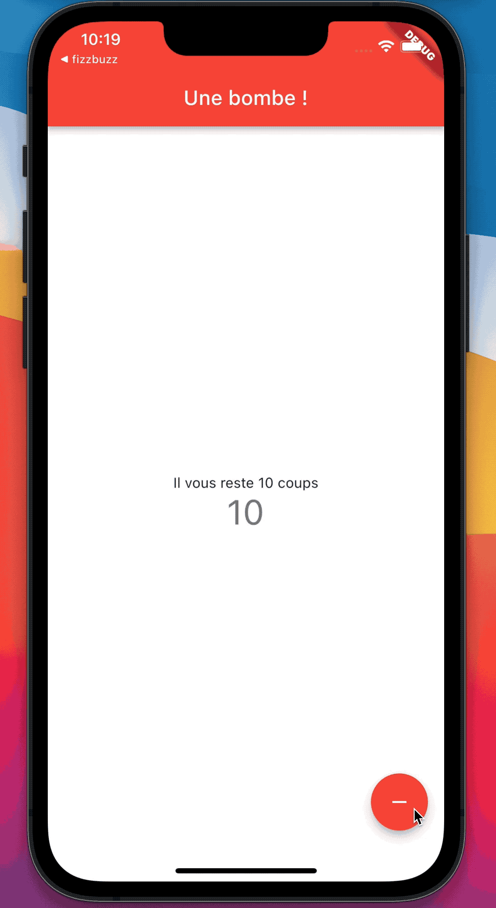

# Une bombe

À partir du boilerplate proposé par Flutter, il est question de transformer le compteur en une bombe en diminuant un nombre.
Dès qu’on arrive à 0, la couleur de fond change et un message simulant une explosion apparait.

C'est aussi l'occasion de découvrir le hot reload ainsi que démarrage forcé.

